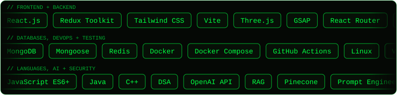

<div align="center">



<br/>


</div>

<br/>

<div align="center">

<br/>

</div>

<br/>

<div align="center">

</div>

```diff
+ [WINNER]     Sheryians Cohort Hackathon 2026  | Team Haunted Hacker
+ [RUNNER-UP]  BGI Hackathon 2026 (Vision 2047 | Viksit Bharat)
                -> among 600+ teams and 2,800+ participants nationwide
+ [CERTIFIED]  Ultimate Web Development Course 2025 | Udemy (22 hrs)
```

<br/>

<div align="center">

<br/>

<br/><br/>

<br/>

</div>

```bash
root@deep:~# cat security_stack.txt

[AUTH]        JWT | OAuth 2.0 | bcrypt | HTTP-only Cookies | RBAC
[HARDENING]   Helmet | CORS | Rate Limiting
[VALIDATION]  Zod | MongoDB Sanitization | XSS Protection
[AI / GENAI]  OpenAI API | RAG | Pinecone | Prompt Engineering | AI Chatbot Integration
```

<br/>

<div align="center">

<br/>
<a href="https://ecelllncte.in"></a>
<br/>
<a href="https://quicklive.tech"></a>
<br/>

<a href="https://github.com/deepsandilya01/Deployment_Panel">
  
</a>
<a href="https://github.com/deepsandilya01/EPAM_Tasks_LNCT_PHOTON">
  
</a>
</div>

<br/>

<div align="center">

</div>

```text
[Jul 2026 - Present]  President, E-Cell LNCTE
  -> Leading vision and strategy for entrepreneurship, innovation and startup culture on campus
  -> Directing cross-functional teams (events, finance, tech) and representing E-Cell externally

[Nov 2025 - Jul 2026] Treasurer (FinOps), E-Cell LNCTE
  -> Managed budgeting, expense tracking and ticket revenue collection
  -> Monitored digital payments and helped oversee digital platform development
```

<br/>

<div align="center">

<br/>


<!-- Snake animation: needs .github/workflows/snake.yml to run once (see workflow file) -->


</div>

<br/>

<div align="center">

<br/>

[](mailto:deepsandilya23@gmail.com)
[](https://linkedin.com/in/deepsandilya01)
[](https://github.com/deepsandilya01)
[](https://x.com/deepsandilya01)
[](https://instagram.com/deepsandilya_01)

<br/>


</div>
